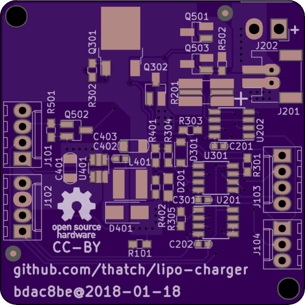

This is in the early stages of prototyping a multi-port 1S Li-po charger.

Features include:

- Wide input voltage (approx 5-24V, untested)
- High charge current (up to ~2.5A, untested)
- Discharge circuit (to arbitrary voltage; connector is limiting factor --
  mosfet can do ~10A)
- (Upstream) microcontroller only involved in the slow loops ("is it charged
  yet?", not "is current limit hit?")
- Relatively inexpensive BOM (compared to all-in-one buck-based chargers)
- Relatively easy to solder (only one part smaller than SO-8 and 0603, no exposed pads)

Open questions:

- Do we need extra soft-start circuitry to avoid current spike at beginning of charge?
- Can we heatsink the discharge circuit so this stacks better (DPAK on back ground plane)?
- How small can we get this as a replaceable daughterboard?
- How will we mount it inside a case?
- Can we trust the sum of individual shunts for calculating used power budget?
- How will MCU stay alive while probing (or backing off)
- Is there a much better way to shut off discharge (second nmos is obvious, but expensive)

License: CC-BY 4.0 International

Disclaimer: This not an official Google product.
